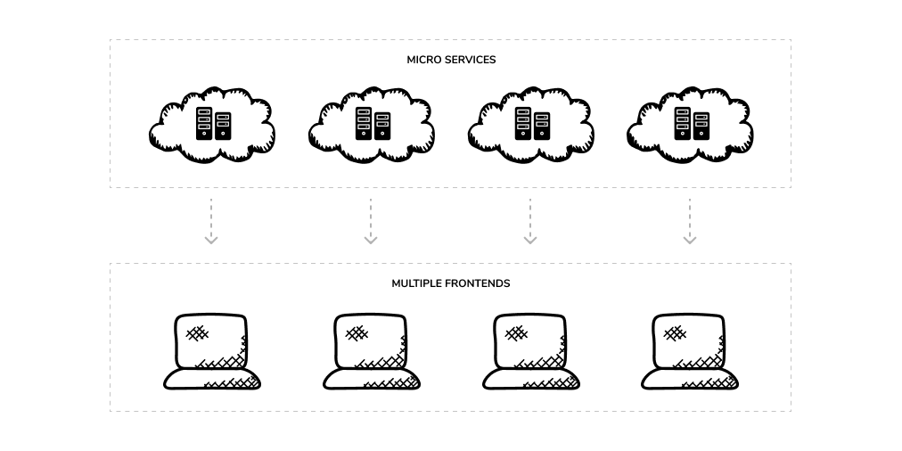
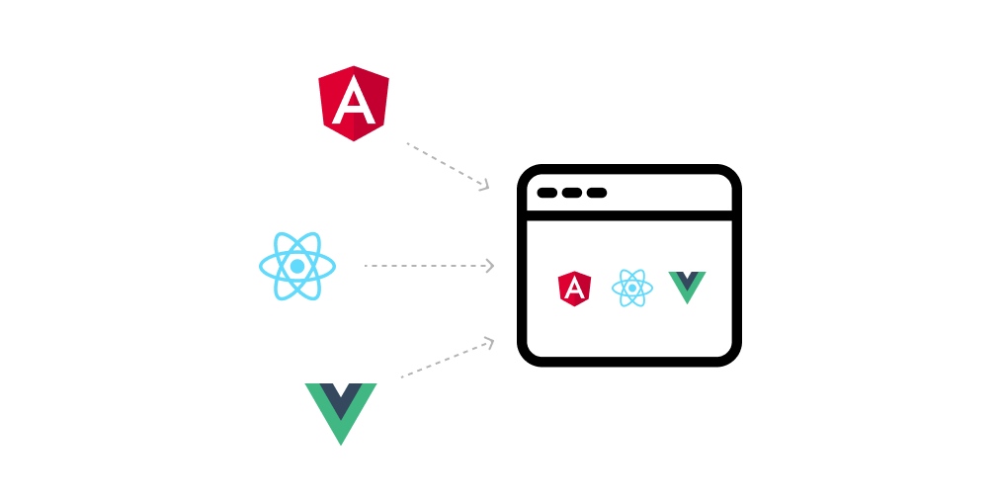
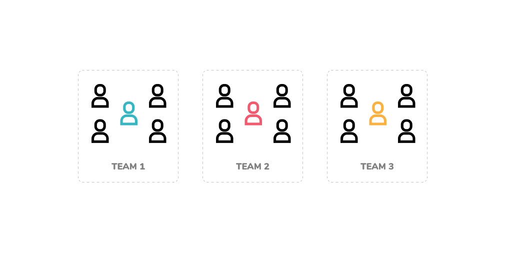
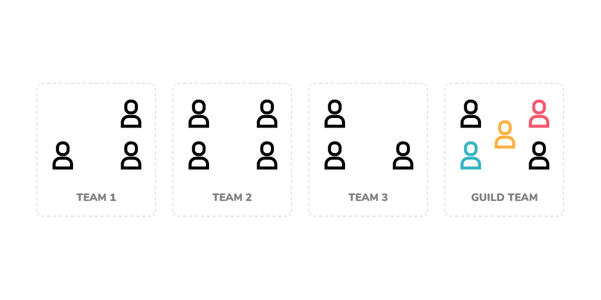
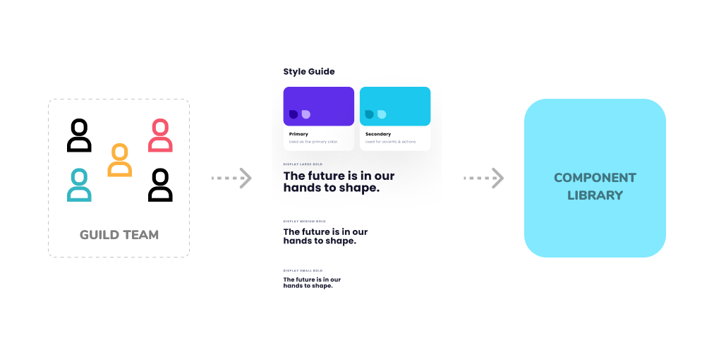
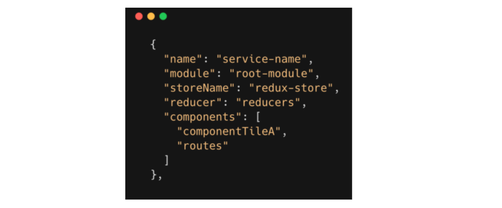
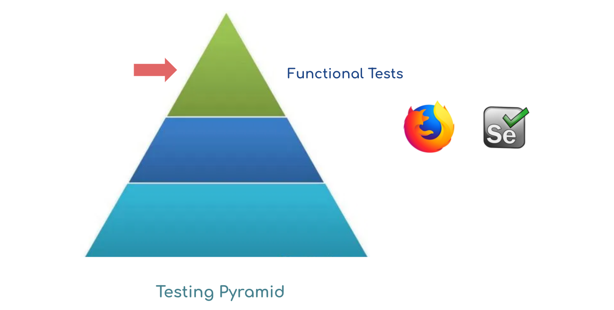

> *Cross posted from [Archimydes blog] (https://archimydes.dev/fourthact/blog/scaling-applications-using-micro-frontends)*

This blog post is a summary of a presentation that I made at the Archimydes Mastermind Event that happened on 17th Dec 2020.

Modern web applications tend to have complex and feature-heavy Frontends when compared to backends.

With so many choices for frameworks and programming paradigms, building a consistent Frontend to scale is a challenging problem to solve. We cover ways in which you can scale your Frontend application and your development teams by using a Micro-Frontends design pattern.

I'll start by introducing the pattern of Micro-frontends first. Then we'll be looking into some of the key decisions that need to be taken while starting a Micro-frontend project. Finally, we will see the circumstances where this pattern will be effective.

## **1. Scaling Applications**

In general, scaling applications implies scaling backend applications to serve an increasing number of users. Usually, it's about how to:

- Increase Performance
- Reduce Latency
- Sustain load
- Manage compute costs

All these parameters are typically applicable for the backend applications.

For frontend applications, we typically stop with a good CDN to deliver static assets efficiently. However,

> Scaling frontend apps is also about scaling development teams, both by size (growing a size of a single team) or count (multiple teams)

Additionally, applications are getting more frontend heavy because: 

- backends are getting easier to deploy and get off the ground
- end-user compute is getting cheaper and more powerful everyday
- more functionality is being pushed to end-user interfaces and devices

As a result of this, product teams need to figure out an efficient way to build and deliver frontend applications with multiple development teams working at scale. Product teams need to execute this while reducing bottlenecks in the development process.

## **2. Monoliths, Microservices and Micro-frontends**

> Monoliths are not a bad design choice

It's always best to start any application as a monolith. Upfront slicing of module boundaries is very hard and tends to go wrong. As the application grows, it's better to identify module boundaries and split them up.

**Microservices**

From monoliths, the best choice to evolve the backend services as microservices. We can then guarantee:

- Strong module boundaries
- Independent deployment
- Polyglot development and tech diversity

However, most of the microservices I have seen are as follows

> Independent deployments ! == Independent releases

Teams are able to develop and deploy backends independently. However, they need to wait for the frontend to be developed and deployed.

**Enter Micro-frontends**

Micro-frontends are nothing but taking the concept of micro-services to the frontend. Slice the frontend of the application to respect the module boundaries of the backend, and create an end-end independent release path.

> All of Microservices' promises + Independent releases

## **Gains with Micro-frontends**

- Independent teams
- Independent releases
- Simple, decoupled codebases
- Incremental upgrades

### **Problems that need solving**

- T***o 'share, or not to share'?*** - Code reusability is one of the most overrated principles in software development. The problems of reusability are often ignored or not shared. In going the micro-frontend way, this needs to be discussed among the teams. Out of the gate, a duplicate first strategy works since it allows teams to execute faster initially.
- **Application loading performance** - Micro-frontends can cause an impact on the loading performance of the application. There are ways to mitigate it, but the effort it takes has to be taken into consideration.
- **Design consistency across the application -** Having a larger number of people working on an application will lead to inconsistencies. Again, there are ways to mitigate this, however, the effort involved in mitigation needs to be considered.

## **3. Key decisions while doing Micro-frontends**

Let's go over some of the major decisions that we need to take during the early stages of a micro-frontend application. I will try to cover the solution(s) that we took while building an application with distributed teams across 3 regions for 2 years. The decisions can vary based on the project context but nevertheless these problems need to be solved.

In order to explain the challenges and decision, I will take up the following use-case:

**Building an application to allow user to configure and buy a laptop. Similar to that of Apple's.** 

A user can ***configure*** a laptop with various components, accessories, protection plans, etc. The user should be able to ***search*** for accessories, or maybe built-in models, and then finally should be able to ***order*** the product and get it fulfilled.

Apart from the 3 services - configure, search, and order, I will have another service called "Frame" merely to hold the application together. 

- **Frame**: A business logic agnostic orchestrator service that knows how to download the rest of the services' frontend

**A) Composing multiple front-ends into a single application**

> End users don't care about the tech used. Their experience should not be affected due to tech.

Composing multiple frontends into a single application is one of the first problems that needs solving when choosing micro-frontends.

**Composing front-ends**

We can achieve this composition in 2 ways, let's go over the pros and cons of these approaches.

## **Build-time Composition vs Run-time Composition**

**Build-time composition** is where multiple frontend applications are built as a single big application and served. This can be accomplished using **npm** or **yarn** packages.

**Pros:**

- Good dependency management, resulting in smaller bundles
- Independent cross team development

**Cons:**

- A monolith built by different teams
- Non atomic deployments

**A Run-time composition** is where the frontends get integrated into the browser directly when the user requests a page. This may be done on the "Server-Side" or in the "Client-Side"

**Pros:**

- Independent teams with independent deployments
- Atomic deployments, so no versioning issues

**Cons:**

- Too many API requests from Client(?), with increased bundle size

**Toolkit options for Runtime composition**

**Server side:**

- SSI (Server Side Includes)
- Tailor (from Zalando)

**Client Side:**

- JSPM
- SystemJS
- FrintJS
- Single-Spa

***We chose Run-time composition for the project we worked on. Since our app was rendered on the client-side, it was simpler for us to achieve this.*** 

## **B) Communication between the frontends**

Multiple frontends need to share data with each other. Though this needs to be minimal, it's unavoidable. A couple of options to achieve this is by:

- **State management tools**

A global store in the application and all frontends using the same library to access the store.

- **Window events**

Another approach could be to utilize the window (DOMs) eventing capability. Below is a sample event.

***We used to communicate through common redux store and redux events as all the apps in our micro-frontends were using Redux.***

## **C) Design Consistency**

One of the hardest problem to solve for is design consistency. 

In our team, we addressed this challenge by forming guilds. Consider that there are three teams, and each team has a designer assigned to it.

We formed a guild comprising of all designers and some interested developers. They encompass a virtual team. They take all the design decisions and make sure their respective teams are abiding by the central design tenets.

Initially, the guild created a style guide for the application. Mainly CSS and the application teams copy-pasted it from the style guide to build components.

As we developed more features, we started pulling out Higher-order JS components and made them sharable. This is more of an evolution and works well once you have a stable design system in place.

And also, since the teams were using the same frontend framework (React) it was easier for us to build this component library.

## **D) Testing Strategy**

Deciding on "How to test" is important. Since it's a relatively newer paradigm and there are lots of moving parts in the application.

Primarily we will be discussing the "Integration tests" and "Functional tests" from the testing strategy, as there won't be much difference in the way the "Unit tests" are done.

- **Integration tests**

Having a lightweight "Consumer Driven Contracts" (CDC) helped us a lot.

A CDC is where the consumer services' give some tests to the provider service. A provider has to run all of its consumer services before publishing an artifact for deployment.

This doesn't need to be very complex and can be done quickly using some lightweight options without using any big frameworks. But then, it's all case by case.

In our scenario, Frame was the consumer of all the services and it shared a simple JSON contract and a small JS test with all of its providers. This ensured that the frame wasn't broken when a service deployed automatically.

- **Functional tests**

This is one of my least favorite testing methods, however, like everything else in tech, it does have some staunch supporters and followers. In our case, we only had a few critical and successful user journeys automated using Selenium for functional testing.

These journeys cut across multiple services and hence are harder to develop and maintain. Some of the FAQs I usually get on these tests are

## **FAQs**

- **Who owns functional tests?**

Ans. The product team and business analysts. They define the scenarios for automation.

- **Who writes functional tests?**

Ans. Guild containing QAs from all teams and a few developers.

- **Who fixes functional tests?**

Ans. Team which breaks it.

## **When should you opt for Micro-frontends?**

Micro frontends are not for everyone. It adds significant overhead with development and maintenance.

- **A. Distributed self-contained teams, with a need for parallelization**

If your development teams aren't co-located, and there is a decent amount of parallelization that needs to be done, this could be a reason to implement micro-frontends.

- **B. Collaborate with different frameworks in the frontend**

Imagine you are inheriting a legacy application but want to build a new feature with modern design elements, then micro-frontends gives you a good head start.

- **C. Teams that have experience building Microservices application, and are willing to take it to the next step**

Most of the points mentioned here are forward-thinking practices. Micro-frontends needs a good solid understanding of the domain and good discipline to contain things within one's boundary. 

Finally, it's worth remembering that:

> It's not a sprint. It's a marathon.

Micro-frontends adds significant overhead to the overall application. This isn't desired for smaller applications or for the application that will be built and managed by a single team. The above mentioned challenges are worth solving, only if you are up for a longer run with multiple teams.
