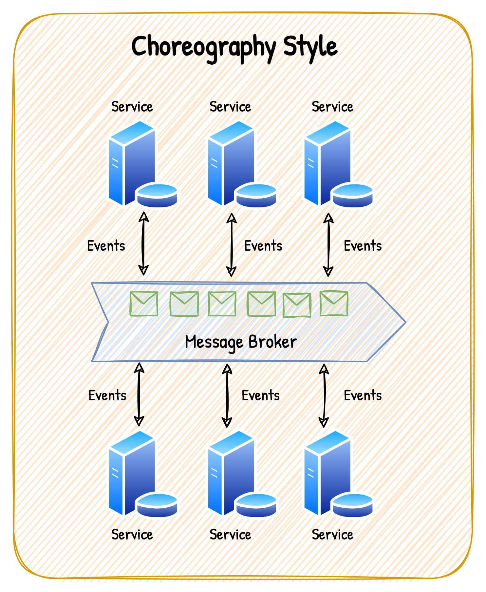
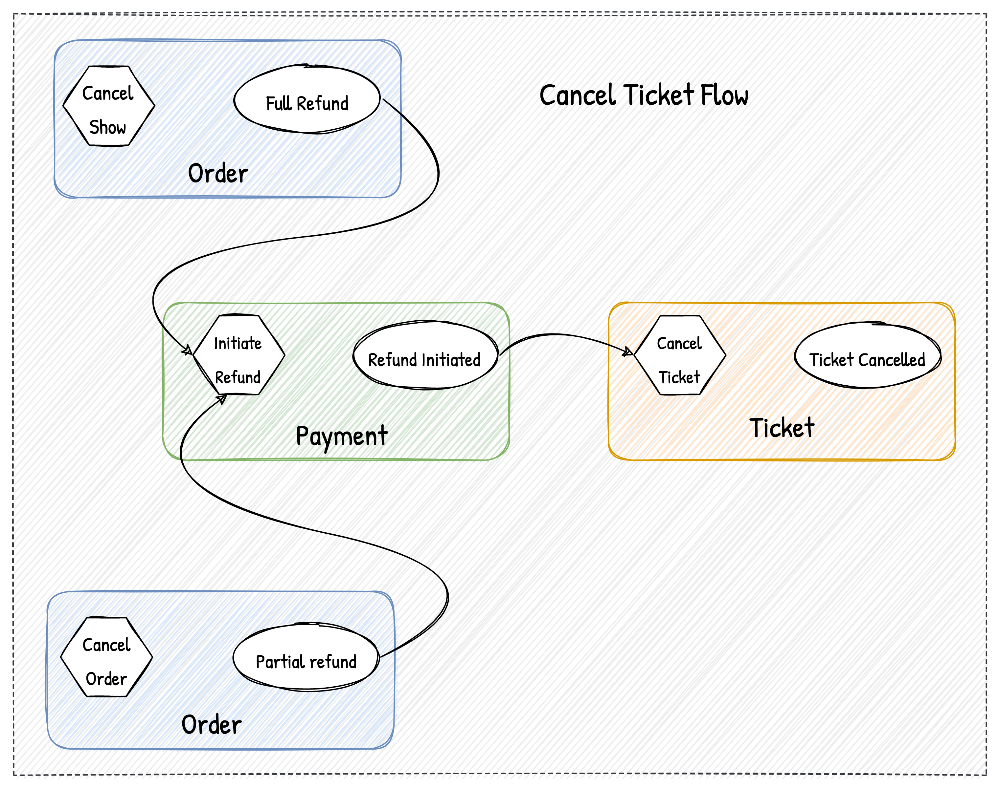

> *Cross posted from [Dev.to blog] *

## What is a Saga pattern

Saga design pattern is a way to manage a single business transaction that spans across various micro services. Saga pattern breaks a single business transaction into a sequence of local transactions that updates each service and publishes a message or event to trigger the next local transaction step. If any of these local transaction fails, saga will execute the subsequent flows to  rollback and cleanup the transaction.

## Why do we need this

In a micro-services architecture, it's hard to trace where the transaction has failed and what needs to be rolled back etc. Saga brings in a structure to deal with this problem and also allows the micro-services to act within the specified boundaries.

## Implementing Saga

Saga is implemented by adding a `transactionId` to all the local transactions. A `transactionId` represent a single business transactions, so with that as an identifier it is possible to trace all the corresponding service interactions.

This managing of local transactions can be done in 2 styles.

- Orchestration style
- Choreography style

## Orchestration Style Sagas

Orchestration pattern mimics an Orchestra, where each person (system in this case) waits for the conductor (another system) to give instructions on what needs to be done.

I don't prefer this design usually for the following reasons,

- Tight coupling between the conductor and the other systems in the ecosystem.
- Conductor is a single point of failure.

## Choreography Style Sagas

Choreography pattern mimics a dance performance where each dancer knows their role and can perform it independently. Hence, there is no need of centralised conductor role.

Some benefits of this pattern are,

- Faster development. Teams can build independently, with defined contracts.
- Loose coupling, easier to change systems.
- Better fault tolerance. There is no single point of failure here

## A Sample Scenario

Let us walk through a sample use case and see how we can go about solving it using choreography style sagas.

Since we are talking about music and dance, let me take a use case of booking a movie ticket.

- A customer can purchase a movie ticket by paying online.
- Once the payment is successful, the movie ticket is confirmed to that customer.
- If there is a payment failure, no ticket will be issued, and the order stands cancelled.
- If the show is cancelled, the customer will be fully refunded.
- If the customer choses to cancel a ticket, then they will be refunded a partial amount only.

## Identifying Events and Commands

Now, to implement them independently by various services, we need to identify the boundaries of various services and also their resposibilities.

[Event storming](https://www.eventstorming.com/) is one activity that the team can do to identify these events aka boundaries of responsibilities.

**Results of the event storming looks like this:**

I will be using the following notion to illustrate various commands and events involved in the above use-case.

Once these events and commands are identified, teams independently can go ahead and start implementing them. Rollbacks are just another events mapped to a different command.

This gives a power to the team to act independently and reduces the bottleneck on a single service.
